* Table of Contents
{:toc}

--------------------------------------------------------------------------------------------------------------------

## **Setting up, getting started**

Refer to the guide [_Setting up and getting started_](SettingUp.md).

--------------------------------------------------------------------------------------------------------------------

## **Design**

### Architecture

The ***Architecture Diagram*** given above explains the high-level design of the App. Given below is a quick overview of each component.

:bulb: **Tip:** The `.puml` files used to create diagrams in this document can be found in the [diagrams](https://github.com/se-edu/addressbook-level3/tree/master/docs/diagrams/) folder. Refer to the [_PlantUML Tutorial_ at se-edu/guides](https://se-education.org/guides/tutorials/plantUml.html) to learn how to create and edit diagrams.

**`Main`** has two classes called [`Main`](https://github.com/se-edu/addressbook-level3/tree/master/src/main/java/seedu/address/Main.java) and [`MainApp`](https://github.com/se-edu/addressbook-level3/tree/master/src/main/java/seedu/address/MainApp.java). It is responsible for,
* At app launch: Initializes the components in the correct sequence, and connects them up with each other.
* At shut down: Shuts down the components and invokes cleanup methods where necessary.

[**`Commons`**](#common-classes) represents a collection of classes used by multiple other components.

The rest of the App consists of four components.

* [**`UI`**](#ui-component): The UI of the App.
* [**`Logic`**](#logic-component): The command executor.
* [**`Model`**](#model-component): Holds the data of the App in memory.
* [**`Storage`**](#storage-component): Reads data from, and writes data to, the hard disk.

Each of the four components,

* defines its *API* in an `interface` with the same name as the Component.
* exposes its functionality using a concrete `{Component Name}Manager` class (which implements the corresponding API `interface` mentioned in the previous point.

For example, the `Logic` component (see the class diagram given below) defines its API in the `Logic.java` interface and exposes its functionality using the `LogicManager.java` class which implements the `Logic` interface.

**How the architecture components interact with each other**

The *Sequence Diagram* below shows how the components interact with each other in the scenario where the user issues the command `delete A1234567X`.

The sections below give more details of each component.

### UI component

**API** :
[`Ui.java`](https://github.com/se-edu/addressbook-level3/tree/master/src/main/java/seedu/address/ui/Ui.java)

The UI consists of a `MainWindow` that is made up of parts e.g.`CommandBox`, `ResultDisplay`, `StudentListPanel`, `AppointmentListPanel`, `StatusBarFooter` etc. All these, including the `MainWindow`, inherit from the abstract `UiPart` class.

The `UI` component uses JavaFx UI framework. The layout of these UI parts are defined in matching `.fxml` files that are in the `src/main/resources/view` folder. For example, the layout of the [`MainWindow`](https://github.com/se-edu/addressbook-level3/tree/master/src/main/java/seedu/address/ui/MainWindow.java) is specified in [`MainWindow.fxml`](https://github.com/se-edu/addressbook-level3/tree/master/src/main/resources/view/MainWindow.fxml)

The `UI` component,

* Executes user commands using the `Logic` component.
* Listens for changes to `Model` data so that the UI can be updated with the modified data.

### Logic component

**API** :
[`Logic.java`](https://github.com/se-edu/addressbook-level3/tree/master/src/main/java/seedu/address/logic/Logic.java)

1. `Logic` uses the `StudentBookParser` class to parse the user command.
1. This results in a `Command` object which is executed by the `LogicManager`.
1. The command execution can affect the `Model` (e.g. adding a student).
1. The result of the command execution is encapsulated as a `CommandResult` object which is passed back to the `Ui`.
1. In addition, the `CommandResult` object can also instruct the `Ui` to perform certain actions, such as displaying help to the user.

Given below is the Sequence Diagram for interactions within the `Logic` component for the `"delete A1234567X"` Command API call.

:information_source: **Note:** The lifeline for `DeleteCommandParser` should end at the destroy marker (X) but due to a limitation of PlantUML, the lifeline reaches the end of diagram.

### Model component

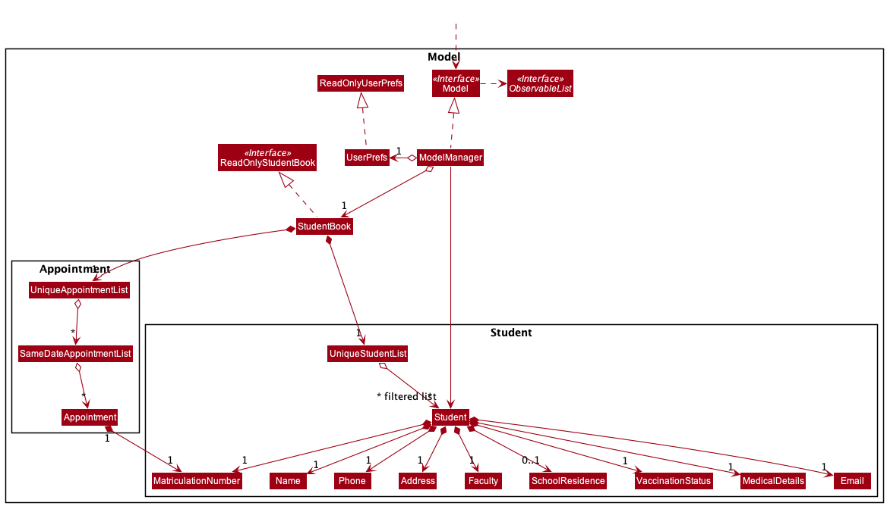

**API** : [`Model.java`](https://github.com/se-edu/addressbook-level3/tree/master/src/main/java/seedu/address/model/Model.java)

The `Model`,

* stores a `UserPref` object that represents the user’s preferences.
* stores the student book data.
* exposes an unmodifiable `ObservableList<Student>` that can be 'observed' e.g. the UI can be bound to this list so that the UI automatically updates when the data in the list change.
* does not depend on any of the other three components.

> **NOTE:** student book contains data of student records and student appointments. 
> 
>
### Storage component

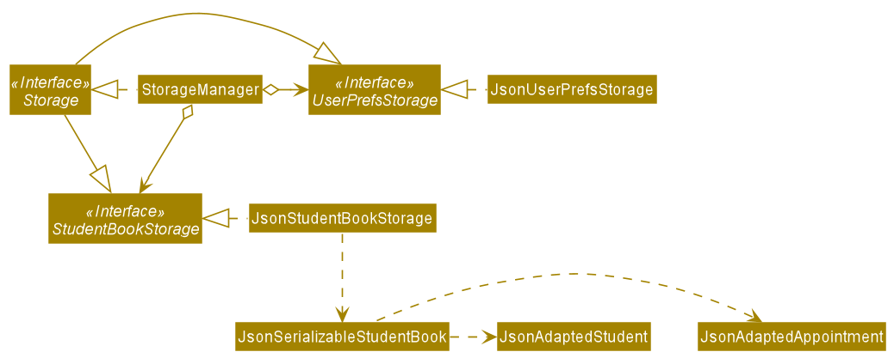

**API** : [`Storage.java`](https://github.com/se-edu/addressbook-level3/tree/master/src/main/java/seedu/address/storage/Storage.java)

The `Storage` component,
* can save `UserPref` objects in json format and read it back.
* can save the student book data in json format and read it back.

### Common classes

Classes used by multiple components are in the `seedu.student.commons` package.

--------------------------------------------------------------------------------------------------------------------

## **Implementation**

This section describes some noteworthy details on how certain features are implemented.

### Add Student `Add`

#### Actual Implementation

The `Add` Student mechanism is implemented in the `AddCommand` class and facilitated by the following classes:
* `Command`. `AddCommand` extends `Command` and overrides the `execute` method, which adds a `Student` to the `Model`. 
* `AddCommandParser`. It implements the `Parser` interface, which is used by all commands to read user input. `AddCommandParser` also checks the parameters of `AddCommand` and make sures that the input adheres to the specified format. 

All 8 compulsory fields and 1 optional field in `Student` are updated and added to the system following the user input. 

Given below is an example usage scenario and how the `Add` Student mechanism behaves at each step.

Step 1: The user executes `add A1234567X n/John Doe f/COM p/98765432 e/johnd@example.com a/John street, block 123, #01-01 s/vaccinated m/peanut allergy r/RVRC` to add a student. The `StudentBookParser` class determines that the command called is `Add`, and therefore creates a new `AddCommandParser` instance to parse the command.

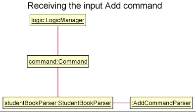

Step 2: The `AddCommandParser` instance obtains the user input and checks for its validity. It then returns a new `AddCommand` instance to the `LogicManager` via the `StudentBookParser` class.

> **NOTE:** If the input format is incorrect or not found, `AddCommandParser` will throw a `ParseException` to tell the user about the error, and execution will stop. 

Step 3: With the `AddCommand` instance, the overridden `execute` method is called to add the `Student` to the `Model`. The `LogicManager` then receives the result of the execution of the command. 

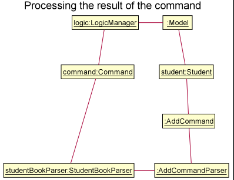

Step 4: The added `Student` is saved into the `StudentBook`. 

The following sequence diagram shows how the `Add` operation works:

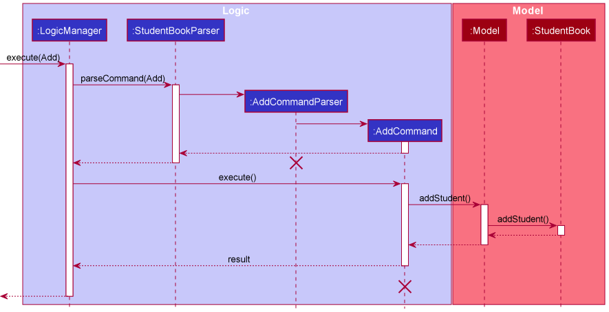

The following activity diagram summarizes what happens when a user executes the `Add` command:

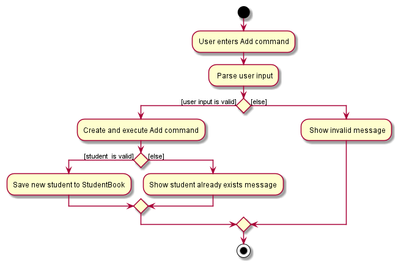

#### Design consideration:

##### Aspect: How `Add` Student executes

* **Alternative 1 (current choice):** Add all the attributes of a student at once
    * Pros: 
      * All the student attributes will be completed in one command, less likely to introduce bugs. 
    * Cons: 
      * Command can be difficult to use, confusing to check. 
      * User needs to know all the attributes of a student before adding to system.  

* **Alternative 2:** Add each student attribute individually
  * Pros: 
    * Easier for user to input, potentially fewer mistakes as user can check each attribute individually.
    * User does not need to know all the information of a student before adding to system. 
  * Cons: 
    * User could forget to add certain attributes, potentially causing bugs later. 
    
In the end, Alternative 1 was chosen because it is less likely to introduce bugs into the system, even though it comes with some usability cost. However, the cost of having multiple bugs could be greater. Moreover, the user can use the edit command afterwards to fix any incorrect information added. This would help to mitigate some downsides of this implementation.

_{more aspects and alternatives to be added}_

### Delete Student `delete`

#### Actual Implementation
The delete student feature helps users to delete a particular student record by the student's matriculation number.

The delete student feature is implemented in the `DeleteCommand` class and facilitated by the following classes:
* `Command`. `DeleteCommand` extends `Command` and overrides the `execute` method, which deletes a `Student` from the `Model`.
* `DeleteCommandParser`. It implements the `Parser` interface, which is used by all commands to read user input. `DeleteCommandParser` also checks the parameters of `DeleteCommand` and make sures that the input adheres to the specified format.

Given below is an example usage scenario and how the delete student mechanism behaves at each step.

Step 1: The user executes `delete A1234567X` to delete a student. The `StudentBookParser` class determines that the command called is `delete`, and therefore creates a new `DeleteCommandParser` instance to parse the command.

Step 2: The `DeleteCommandParser` instance obtains the user input and checks for its validity. It then returns a new `DeleteCommand` instance to the `LogicManager` via the `StudentBookParser` class.

> **NOTE:** If the input format is incorrect or not found, `DeleteCommandParser` will throw a `ParseException` to notify the user of the error, and the execution will stop.
> 

Step 3: With the `DeleteCommand` instance, the overridden `execute` method is called to delete the `Student` from the `Model`. The `LogicManager` then receives the result of the execution of the command.

Step 4: The specified `Student` is deleted from the `StudentBook`.

The following sequence diagram shows how the delete student operation works:

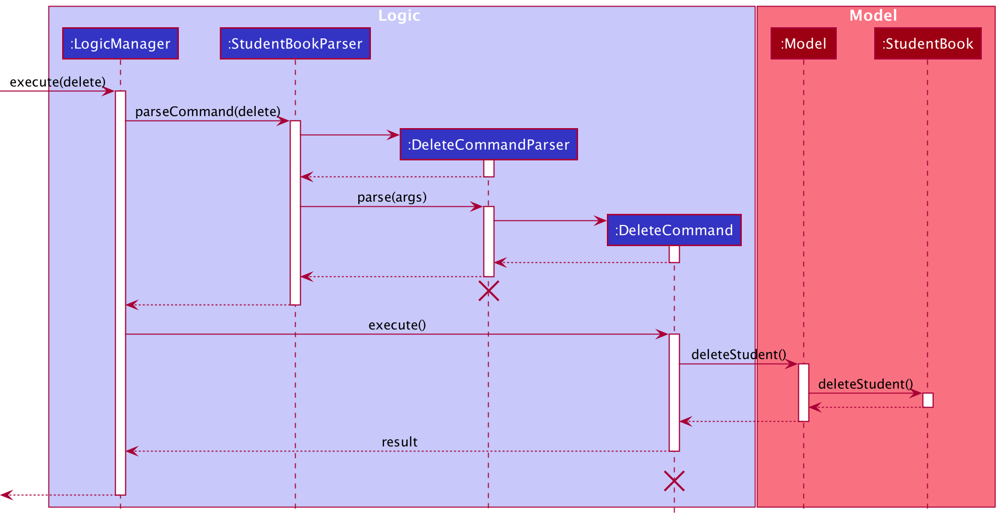

The following activity diagram summarizes what happens when a user executes the `delete` command:

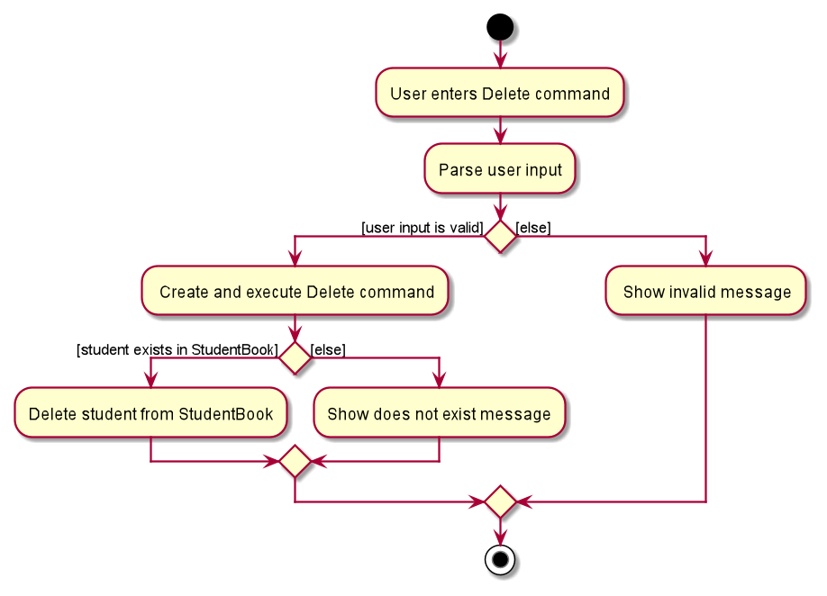

#### Design consideration:

##### Aspect: How Delete Student executes

* **Alternative 1 (current choice):** Delete student based on student's matriculation number.
    * Pros:
        * User can ensure that the correct student will be deleted as matriculation number is unique to a student.
    * Cons:
        * User is required to know the student's matriculation number to perform the action.

* **Alternative 2:** Find student using student's name
    * Pros:
        * User is not required to know the student's matriculation number.
    * Cons:
        * User might have to go through extra steps to identify and delete a student if there is another student with the same name in the system.
        * User has to type more words if the student name is too long.

In the end, Alternative 1 was chosen because it is less likely to introduce bugs into the system, even though it comes with some usability cost.
Furthermore, in Alternative 2, the user could potentially identify and delete the wrong student if there are multiple students sharing the same name.

### Add Appointment `AddAppt`

#### Actual Implementation
An appointment is uniquely determined by a student's matriculation number. Other attributes relevant to an appointment include date, start time, and end time, all of which are compulsory.

The add appointment feature is facilitated by `AddCommandParser` and `AddAppointmentCommand`. Implementing `Parser` interface, `AddCommandParser` takes in user's command and creates a new appointment based on the parsed data. `AddAppointmentCommand`, inheriting from `Command`, adds the newly created `Appointment` to the `Model`.

Given below is an example usage scenario that elucidates the mechanism of the add appointment feature.

Step 1: The user executes `addAppt A1234567X d/2021-12-13 ts/13:00 te/14:00` to add an appointment. `StudentBookParser` determines that the command called is to add an appointment, hence creating a new `AddCommandParser` instance.

Step 2: The `AddCommandParser` instance parses the user input and performs validation on the parsed data. It then creates a new `AddAppointmentCommand` instance.

> **NOTE:** If the input format is incorrect or not found, `AddAppointmentCommandParser` will throw a `ParseException` to notify the user of the error.

Step 3: `AddAppointmentCommand` executes to add the appointment to `Model`. The `LogicManager` then receives the result of the execution of the command.

Step 4: The added `Appointment` is saved into the `StudentBook`.

The following sequence diagram shows how the add appointment operation works:

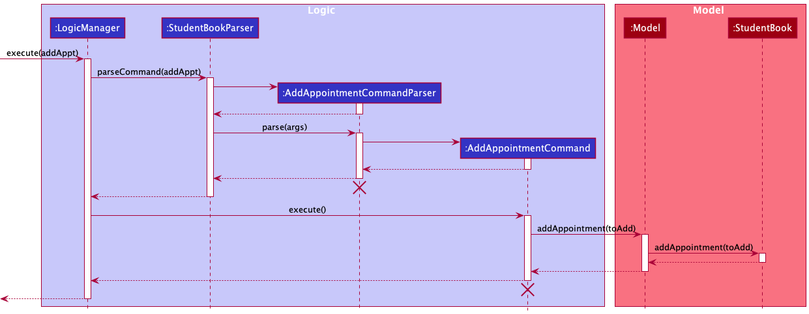

The following activity diagram summarizes what happens when a user executes the `AddAppt` command:

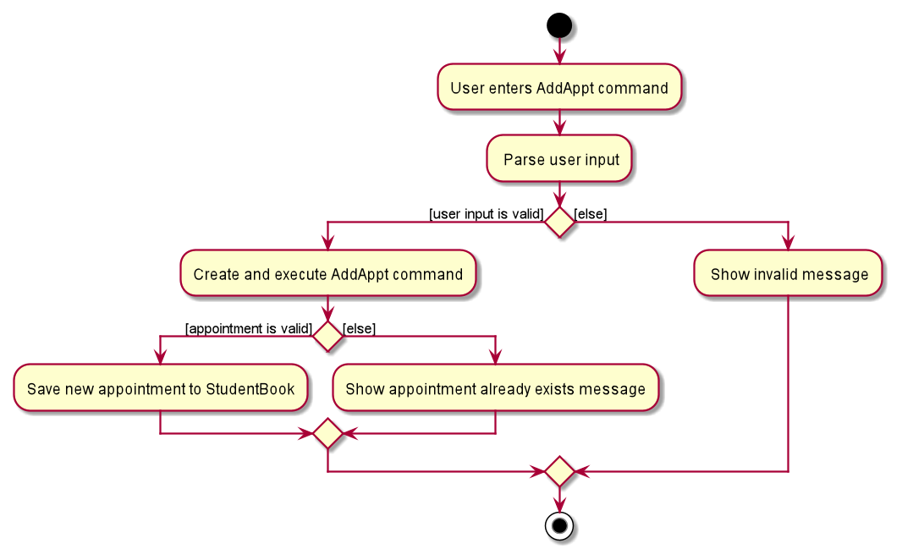

#### Design consideration:

##### Aspect: How Add Appointment executes

* **Alternative 1 (current choice):** Add a new appointment using student's matriculation number.
    * Pros:
        * Each appointment is ensured to be unique to every student.
    * Cons:
        * Using matriculation number instead of student's name might not be intuitive.
        * User needs to know student's matriculation number before adding a new appointment.

* **Alternative 2:** Add a new appointment using student's name
    * Pros:
        * More intuitive for user.
        * User does not need to know student's matriculation to perform the action.
    * Cons:
        * Problems might arise when different students have the same name, leading to a potentially complicated error handling mechanism.

In the end, Alternative 1 was chosen because it is less likely to introduce bugs into the system, even though it comes with some usability cost. Alternative 1 also minimizes potentially taxing actions required to resolve scenarios where different students have the same name.

### Find Student `find`

#### Actual Implementation

The find student feature helps users to locate a particular student record by the student's matriculation number along with the corresponding appointment if present.

This feature is facilitated by `FindCommandParser` which implements the `Parser` interface and `FindCommand` which extends the abstract class `Command`. 
`FindCommandParser` takes in the user's command and validates the input before passing it to `FindCommand`.
`FindCommand` will invoke a method to search for the particular student record and the corresponding appointment in `Model` and return the specific student record if the student exists and corresponding appointment if an appointment belong to the student.

Given below is an example usage scenario and how the find student mechanism behaves at each step.

Step 1: The user executes `find A0175678U` into Vax@NUS.

Step 2: The input will be parsed to the `LogicManager execute` method which invokes `FindCommandParser` to perform validation on the input.
> **NOTE:** If the matriculation number given by the user is in the wrong format, `FindCommandParser` will throw a `ParseException` to stop the execution and inform user about the error.

Step 3: The instance of `FindCommandParser` will create a new `FindCommand` instance which will retrieve and return the student record of the particular student and the corresponding appointment belonging to the student from `Model` if it exists.

Step 4: Display the particular student record and appointment onto the UI. 

The following sequence diagram shows how the find operation works:

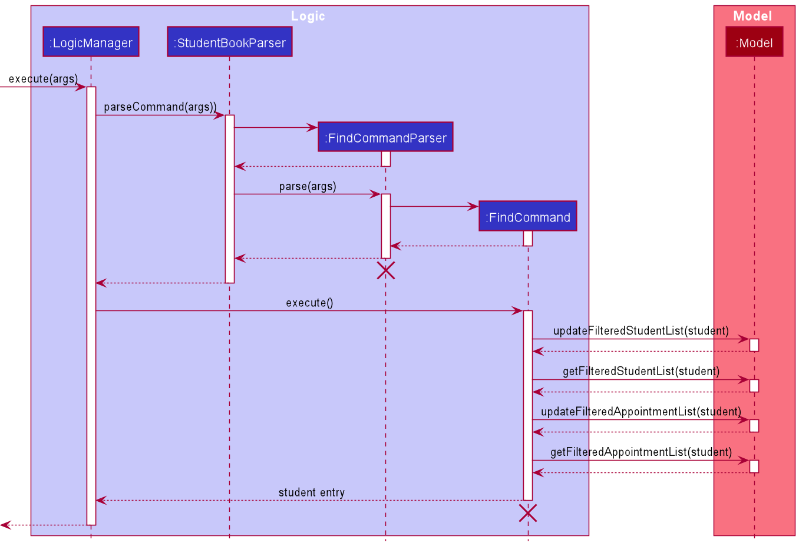

The following activity diagram summarizes what happens when a user executes the `Find` command:

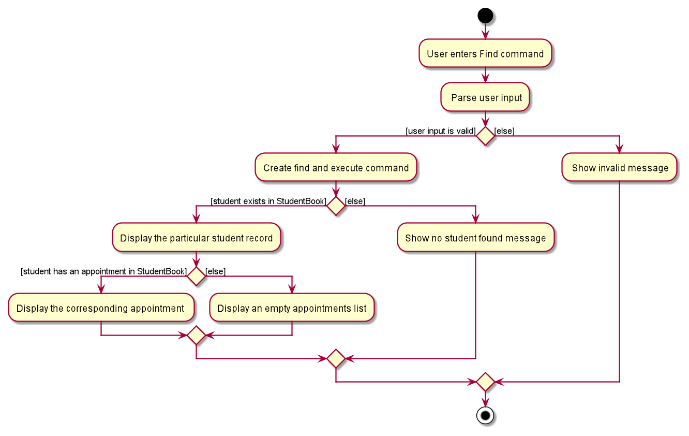

#### Design consideration:

##### Aspect: How Find Student executes

* **Alternative 1 (current choice):** Find student based on student's matriculation number.
    * Pros:
        * Each student record found uniquely identifies a student. 
        * Only one student record and one appointment is shown if the particular student exists and has an appointment in the system. 
    * Cons:
        * The user is required to know the student's matriculation number to perform the action. 
        

* **Alternative 2:** Find student using student's name
    * Pros:
        * User is not required to know the student's matriculation number.
    * Cons:
        * Multiple student records and appointments will be shown for students with the same name. Users will have to manually look through all entries to find the desired student and appointment records.
        * The user has to type more words if the student name is too long. 

In the end, Alternative 1 was chosen because it is less likely to introduce bugs into the system, even though it comes with some usability cost. 

--------------------------------------------------------------------------------------------------------------------

## **Documentation, logging, testing, configuration, dev-ops**

* [Documentation guide](Documentation.md)
* [Testing guide](Testing.md)
* [Logging guide](Logging.md)
* [Configuration guide](Configuration.md)
* [DevOps guide](DevOps.md)

--------------------------------------------------------------------------------------------------------------------

## **Appendix: Requirements**

### Product scope
**Target user profile story**:    
Ian is a former air crew with Singapore Airlines. He recently lost his job due to the COVID-19 pandemic resulting in the collapse in international travel.
He found a job with the University Health Center (UHC) as an admin executive. He is a fast typer with good knowledge of the command line interface.
Currently, Ian is using Excel to keep track of all the student records and vaccination appointments in UHC. With so many rows and columns of data to look at, 
Ian finds it difficult to sieve information and is prone to making human errors.

**Target user profile**:

* UHC staff who has a need to manage a significant number of appointments and student records
* UHC staff who has to keep track of NUS (National University of Singapore) students' COVID-19 vaccinations regarding:
  * Who has been vaccinated
  * Who has not been vaccinated
  * Who wants to be vaccinated
    * Medical histories, existing medical conditions and allergies
* Prefers desktop apps over other types
* Can type fast
* Prefers typing to mouse interactions
* Reasonably comfortable using CLI apps
* Tired of looking at multiple rows and columns in Excel for long hours daily

**Value proposition**: a one stop management app to efficiently track and schedule COVID-19 vaccinations for NUS students

### User stories

Priorities: High (must have) - `* * *`, Medium (nice to have) - `* *`, Low (unlikely to have) - `*`

| Priority | As a …​                                 | I want to …​                | So that I can…​                                                     |
| -------- | ------------------------------------------ | ------------------------------ | ---------------------------------------------------------------------- |
| `* * *`  | user                                       | add a new student record       | keep track of that student's vaccination status                        |
| `* * *`  | user                                       | edit a student's record        | update the system of student's records should changes occur            |
| `* * *`  | user                                       | delete a student's record      | remove records that I no longer need or I accidentally added           | |
| `* * *`  | user                                       | view student statistics        | understand the progress of the vaccination program                      |
| `* * *`  | user                                       | add an appointment for a student | schedule and keep track of that student's appointment                |
| `* * *`  | user                                       | arrange for appointments without timing clashes | maximise the number of appointments in a day to increase UHC's efficiency and effectivity |
| `* * *`  | user                                       | quickly arrange for appointments without manually checking for timing clashes | effectively and efficiently schedule appointments |
| `* * *`  | user                                       | edit a student's appointment    | update the system of appointments should changes occur                 |
| `* * *`  | user                                       | delete a student's appointment  | remove appointments that I no longer need or I accidentally added    |
| `* * *`  | user                                       | list all data                   | view all student records and appointments at once                      |
| `* *`    | user                                       | find a student and their appointment | locate a particular student record and their appointment (if it exists) without traversing the entire list   |
| `* *`    | user                                       | filter student records         | view a specific group of student records |
| `* *`    | new user                                   | see the usage of commonly used commands   | quickly refer to instructions when I forget how to use Vax@NUS    |
| `* *`    | new user                                   | see the usage of all instructions         | refer to instructions when I forget how to use less common commands in Vax@NUS     |
| `* *`    | user                                       | see medical history (e.g. allergies, pre-conditions) of a student | pass this critical information to the nurse in charge    |
| `* *`    | user                                       | view appointment statistics     | understand the efficiency of the vaccination program                   |
| `* * `   | user                                       | view number of appointments for the upcoming week  | understand how busy UHC vaccination staff will be for the next week |
| `*`      | user                                       | prioritise students for the vaccination | schedule the higher priority students to have earlier appointments                 |
| `* `   | user                                         | quickly craft a vaccination appointment message | quickly send students reminder messages for their appointments |
| `* `   | user                                         | export statistics as a PDF | submit to my supervisor to easily update about the progress of the vaccination program |

### Use cases

(For all use cases below, the **System** is the `Vax@NUS` and the **Actor** is the `user`, unless specified otherwise)

**Use case: Add a student record**

**MSS**

1.  User requests to add a specific student record.
2.  System prompts for student's details.
3.  User inputs the respective details.
4.  System adds the student record.

    Use case ends.

**Extensions**

* 1a. The specified student record exists in the system.

    * 1a1. System shows an error message.
  
        Use case ends.

* 3a. User does not give sufficient inputs to add a student record.

    * 3a1. System shows an error message.
  
        Use case ends.  

**Use case: Add a vaccination appointment**

**MSS**

1.  User requests to add a vaccination appointment.
2.  System prompts for details about the vaccination appointment.
3.  User inputs the respective details.
4.  System adds the vaccination appointment.

    Use case ends.

**Extensions**

* 3a. User does not give sufficient inputs to add a vaccination appointment.

    * 3a1. System shows an error message.
  
        Use case ends.
        
* 4a. The given appointment date and time clashes with an existing vaccination appointment for another student.
    
   * 4a1. System shows an error message.

      Use case ends.  

**Use case: Find a student**

**MSS**

1.  User requests to find a specific student.
2.  System prompts for student's matriculation number.
3.  User inputs the matriculation number.
4.  System finds the student. 
5.  System finds the corresponding appointment belonging to the student. 
6.  System displays student and appointment. 
    
    Use case ends.

**Extensions**

* 1a. Specified student does not exist.

    * 1a1. System shows an error message.
  
        Use case ends.

* 3a. User input matriculation number in the wrong format.

    * 3a1. System shows an error message.
  
        Use case ends.
        
* 4a. Student is not found.

    * 3a1. System shows a message informing users that the student is not found.
  
        Use case ends.

* 5a. Student has no appointment.

    * 3a1. System show an empty view for appointment list.
  
        Use case ends.   
        
**Use case: Delete a student**

**MSS**

1.  User requests to delete a specific student.
2.  System prompts for confirmation of deletion.
3.  User confirms.
4.  System deletes the student. 

    Use case ends.

**Extensions**

* 1a. Specified student does not exist.

    * 1a1. System shows an error message.
  
        Use case ends.

* 3a. User does not confirm.

  Use case ends.

### Non-Functional Requirements

1.  **Accessibility**
    * Vax@NUS should work on any _mainstream OS_ as long as it has Java `11` or above installed.
1.  **Reliability**
    * Vax@NUS should be able to hold up to 35000 students (NUS undergraduate cohort size) and 35000 appointments without a noticeable sluggishness in performance for typical usage.
    * A user should be able to use Vax@NUS even while offline.
1.  **Usability**
    * A user with above average typing speed (41.4 words per minute) for regular English text (i.e. not code, not system admin commands) should be able to accomplish most of the tasks faster using commands than using a mouse.
    * A user should be able to use Vax@NUS without a mouse.
1. **Security**
    * A user should only be able to access Vax@NUS if they are an authorized UHC staff.
    * The data in Vax@NUS should not be used or transferred to anywhere else unless authorized.
1. **Quality**
    * Vax@NUS should be able to be used by a novice who has never used a data management application.
1. **Notes about project scope**
    * Vax@NUS is not required to export statistics reports to PDF files.
    * Vax@NUS is not required to export data for printing.

### Glossary

* **Mainstream OS**: Windows, Linux, Unix, OS-X
* **COVID-19**: The COVID-19 pandemic, also known as the coronavirus pandemic, is a global pandemic of coronavirus disease 2019 (COVID-19) caused by severe acute respiratory syndrome coronavirus 2 (SARS-CoV-2).
* **Vaccine**: Singapore has two approved COVID-19 vaccines, one developed by Pfizer-BioNTech, 
  the other by Moderna. Both require two doses, 21 days apart for Pfizer-BioNTech, 28 days apart for Moderna.

--------------------------------------------------------------------------------------------------------------------

## **Appendix: Instructions for manual testing**

Given below are instructions to test the app manually.

:information_source: **Note:** These instructions only provide a starting point for testers to work on;
testers are expected to do more *exploratory* testing.

### Launch and shutdown

1. Initial launch

   1. Download the jar file and copy into an empty folder

   1. Double-click the jar file Expected: Shows the GUI with a set of sample students and appointments. The window size may not be optimum.

1. Saving window preferences

   1. Resize the window to an optimum size. Move the window to a different location. Close the window.

   1. Re-launch the app by double-clicking the jar file. 
       Expected: The most recent window size and location is retained.
      
### Deleting a student

1. Deleting a student while all students are being shown

   1. Prerequisites: List all students using the `list` command. Sample data of students and appointments shown in the list.

   1. Test case: `delete A0182345T` 
      Expected: First student (Alex Yeoh) is deleted from the list. Details of the deleted student shown in the status message. 
      Alex Yeoh's student details and appointment details disappear from the GUI.

   1. Test case: `delete A1212121J` 
      Expected: No student is deleted. Error details shown in the status message telling user no student with the specified matriculation number exists. 

   1. Test case: `delete A12345J` 
      Expected: No student is deleted. Error details shown in the status message telling user the input is not a valid matriculation number.
 
   1. Test case: `delete aBc 123` 
      Expected: No student is deleted. Error details shown in the status message telling user the input is not a valid matriculation number.
      
   1. Other incorrect delete commands to try: `delete`, `delete x`, `...` (where x is not a valid matriculation number)  
      Expected: Similar to previous.
      
### Saving data

1. Dealing with missing/corrupted data files

   1. _{explain how to simulate a missing/corrupted file, and the expected behavior}_

1. _{ more test cases …​ }_
