* Table of Contents
{:toc}

--------------------------------------------------------------------------------------------------------------------
## Introduction

Welcome to Vax@NUS!

Vax@NUS was conceived at the start of Singapore's COVID-19 vaccination campaign. Our team sought to develop a solution to keep track and schedule COVID-19 vaccinations 
for the University Health Centre (UHC), which is responsible for administering vaccines to NUS students. 
Feedback gathered from staff revealed that the existing system was slow and difficult to use, potentially impacting the speed of the vaccination rollout. 

Therefore, Vax@NUS was developed. It is a **one stop management app to efficiently track and schedule COVID-19 vaccinations for NUS students.** 
It allows UHC staff to enter profiles of NUS students into the app, create and schedule vaccination appointments for students, and update their details with just a few simple commands.
Staff can also use the statistic function to view at a glance, the vaccination rates of students, and the number of appointments booked for the upcoming week.

Vax@NUS is a desktop app **optimized for use via a Command Line Interface (CLI)** while still having the benefits of a Graphical User Interface (GUI).
If you can type fast, Vax@NUS can get your appointment management tasks done faster than traditional GUI apps.

This project was done as part of the module CS2103T Software Engineering at the School of Computing of the National University of Singapore.

Read on to find out how you can use Vax@NUS.

## Navigating the User Guide 

This section aims to help you to navigate the user guide. 
  

[Quick start](#quick-start) section has been provided to help you set up Vax@NUS. 
 

Alternatively, to learn more about our features and the details of each command, do refer to [Features](#features). 
 

If you are interested to know about the valid input taken in by our commands, do take a look at [Input-Formats](#input-formats).

:information_source: This icon indicates helpful notes. 

`command`: Words enclosed in a grey box are words used in Vax@NUS’s commands. 

## Quick start

1. Ensure you have Java `11` or above installed in your Computer.

1. Download the latest `VaxAtNUS.jar` from [here](https://github.com/AY2021S2-CS2103T-W10-4/tp/releases).

1. Copy the file to the folder you want to use as the _home folder_ for your Vax@NUS application.

1. Double-click the file to start the app. The GUI similar to the one below should appear in a few seconds. 
   Sample data will be displayed to show you how the user interface of the app looks.
   
   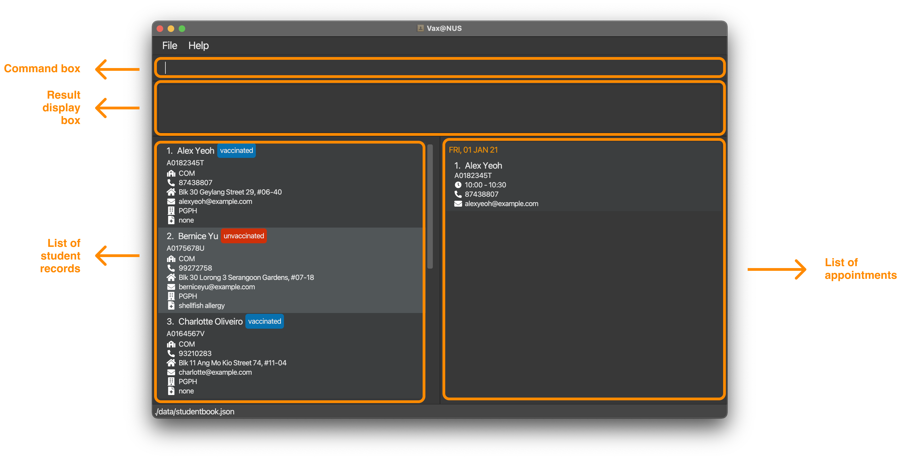
   
   
   
1. Type the command in the command box and press Enter to execute it. e.g. typing **`help`** and pressing Enter will open the help window. 

1. Before you begin using Vax@NUS, here are some example commands you can use to work with the sample data to familarize yourself:
   * `add A1234567X n/John Doe f/COM p/98765432 e/johnd@example.com a/John street, block 123, #01-01 s/vaccinated m/peanut allergy r/RVRC
     `**  
     Adds a student named John Doe, identified by matriculation number A1234567X, to the student records, along with relevant personal details.
   * `addAppt A1234567X d/2021-12-13 ts/13:00
     `**  
     Creates a new vaccination appointment for John Doe, identified with matriculation number A1234567X, at the specified date and time. 
   * `statsAppt`**  
    Tells you the number of appointments in the past week, and in the next week.
   * `delete A1234567X`**  
    Deletes the information for John Doe, identified by his matriculation number, from the student records. Note that since
     John Doe also has a vaccination appointment created, the appointment will also be deleted. 

1. Refer to the [Features](#features) below for details of each command.
1. When you are ready, you can remove all sample data with the `clear` command and begin adding real data. 

--------------------------------------------------------------------------------------------------------------------

## Prefix Table

This table shows you which prefix should be used for the different pieces of information.

Prefix | Keyword           | Used As
-------|-------------------|----------                  
**n/** | NAME              | `n/NAME`
**f/** | FACULTY           | `f/FACULTY`
**p/** | PHONE_NUMBER      | `p/PHONE_NUMBER`
**e/** | EMAIL             | `e/EMAIL`
**a/** | ADDRESS           | `a/ADDRESS`
**s/** | VACCINATION_STATUS| `s/VACCINATION_STATUS`
**m/** | MEDICAL_DETAILS   | `m/MEDICAL_DETAILS`
**r/** | SCHOOL_RESIDENCE  | `r/SCHOOL_RESIDENCE`

Please also refer to the [Input Formats](#input-formats) section below to find out how the information
should be formatted.

----------------------------------------------------------------------------------------------------

## Features

**:information_source: NOTE ABOUT THE COMMAND FORMAT :** 

* Words in `UPPER_CASE` are the parameters to be supplied by the user. 
  e.g. in `add n/NAME`, `NAME` is a parameter which can be used as `add n/John Doe`.

* Items in square brackets are optional. 
  e.g `n/NAME [r/SCHOOL RESIDENCE]` can be used as `n/John Doe r/RC4` or as `n/John Doe`.
    
* Prefixed parameters can be in any order. 
  e.g. if the command specifies `n/NAME p/PHONE_NUMBER`, `p/PHONE_NUMBER n/NAME` is also acceptable.

### General Features

#### Listing all data : `list`

Shows a list of all students and all appointments in Vax@NUS records.

Format: `list`

#### Viewing help : `help`

Display a pop-up window showing a list of commonly used commands in Vax@NUS and a link to our User Guide. 

Format: `help`

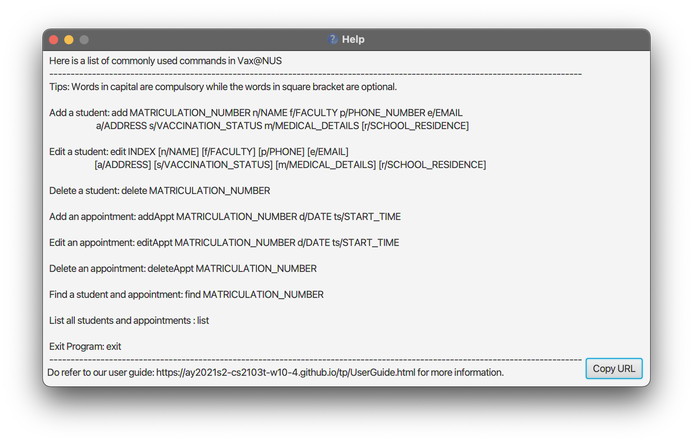

#### Clearing all data : `clear`

Vax@NUS will clear all the student and appointment data and display an empty list of student records and appointments.

Format: `clear`

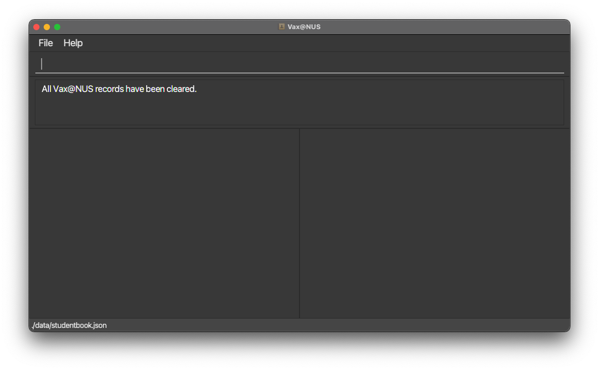

#### Exiting the program : `exit`

Exits the program.

Format: `exit`

#### Saving the data

Vax@NUS saves your current data into your computer automatically after any command. There is no need to save manually.

 :information_source: **NOTE:**  Vax@NUS will display our sample data file if no data file is found from your computer.

### Student Records Management Features

#### Adding a student record: `add`

Adds the details of a student to Vax@NUS records. 

Format: `add MATRICULATION_NUMBER n/NAME f/FACULTY p/PHONE_NUMBER e/EMAIL a/ADDRESS s/VACCINATION_STATUS m/MEDICAL_DETAILS [r/SCHOOL_RESIDENCE]`

Example:

To add a new student,
 
 1. Enter the input  `add A1234567X n/John Doe f/COM p/98765432 e/johnd@example.com a/John street, block 123, #01-01 s/vaccinated m/peanut allergy r/RVRC` into the command box.

 2. The new student will be added at the end of the list and into Vax@NUS' record. The list of students will be also display the new student's particulars.

#### Editing a student record: `edit`

Edits a student in Vax@NUS records at the specified INDEX. The index refers to the index number shown in the displayed student list. The index must be a positive integer 1, 2, 3, …

Format: `edit INDEX [n/NAME] [f/FACULTY] [p/PHONE] [e/EMAIL] [a/ADDRESS] [s/VACCINATION_STATUS] [m/MEDICAL_DETAILS] [r/SCHOOL_RESIDENCE]`

All inputs specified are optional, but at least one of them must be provided. After execution of the `edit` command, the existing value specified will be updated to the input value.  

 :information_source: **NOTE:** Every field except the student's matriculation number can be edited. Should you wish to edit the matriculation number of a student, you must first delete the student entry and add a new one with the updated matriculation number. 

Examples:

1. Suppose, John Doe has just changed his course and is currently studying in the Faculty of Engineering. Simply enter the command `edit 7 r/ENG` to edit his faculty. 

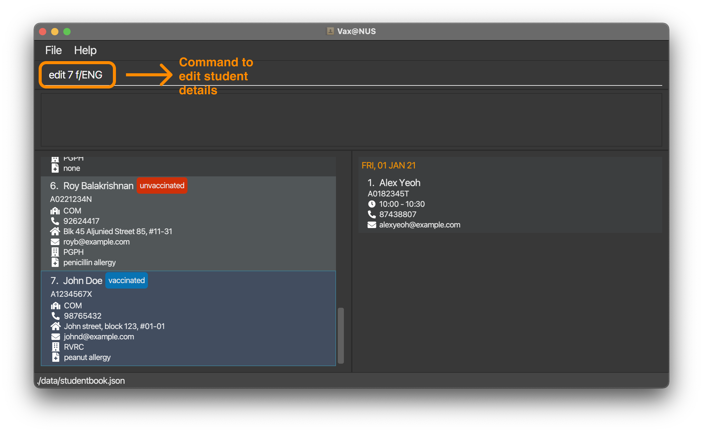

2. John Doe's particulars will be updated and the new information will be displayed in the list of student records.  

#### Deleting a student record: `delete`

Deletes the student specified by his/her matriculation number from Vax@NUS records.

Format: `delete MATRICULATION NUMBER`

* If the matriculation number does not exist in the records, a message will be shown to inform users that 
  no student with the specified matriculation number can be found in the records.
* If the student to be deleted has an appointment, the student's appointment will be deleted as well.
  
Examples:

1. Suppose, you want to delete John Doe from the records. You can enter `delete A1234567X` and his corresponding appointment will be deleted as well.

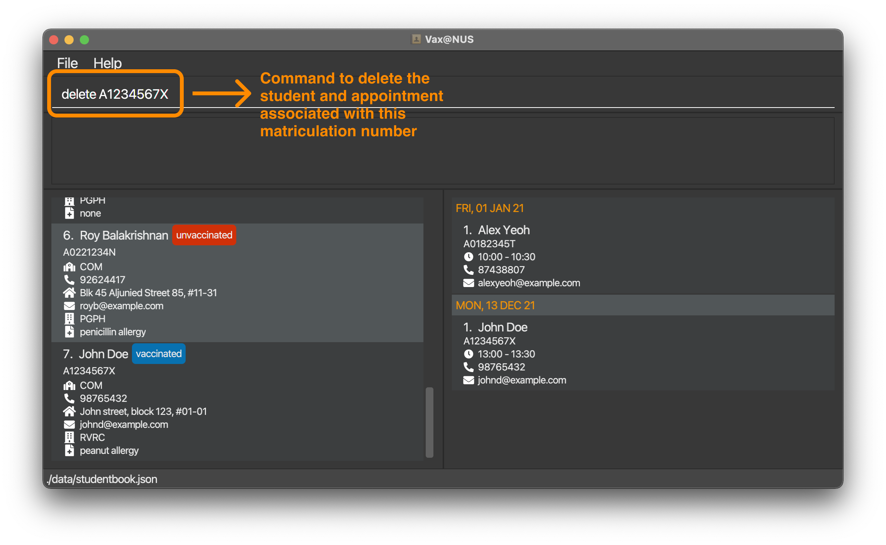

2. Upon deletion, the list of student records will be updated accordingly. 

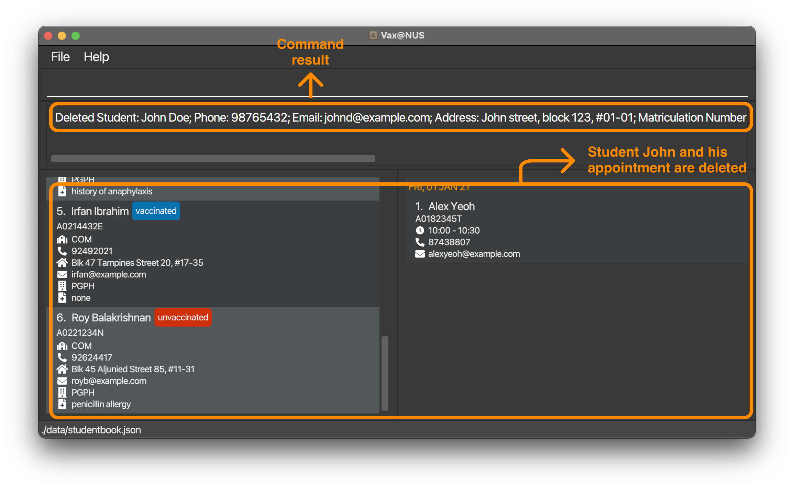

#### Filtering all student records: `filter`

Shows all student records in Vax@NUS that matches the specified vaccination status, faculty or school residence.

:information_source: **NOTE:** The filter command only changes the view of the student list and not the view of the appointment list.

Format:  
`filter VACCINATION_STATUS`
  `filter FACULTY`
  `filter SCHOOL_RESIDENCE`

* Only one condition should be specified at a time. In this case, a condition refers to `VACCINATION_STATUS`, `FACULTY` or `SCHOOL_RESIDENCE`

Examples:
* `filter vaccinated` or `filter unvaccinated`
* `filter COM` 
* `filter RVRC` 

1. Enter `filter vaccinated` to see a list of vaccinated students. 
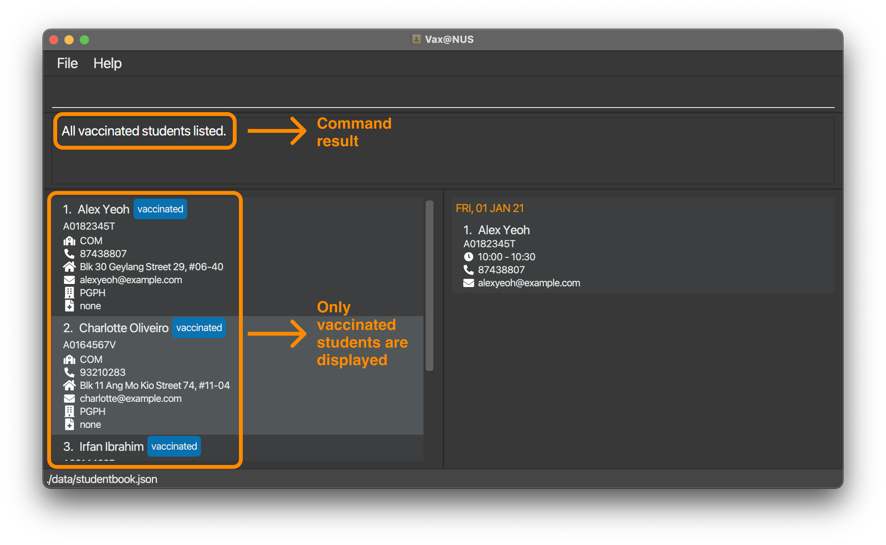

#### Viewing statistics for student population: `stats`

Displays percentage of vaccinated students in the specified faculty/school residence, whole of NUS, or a list of percentages of vaccinated students in every Faculty and School Residence. 

Format:  
`stats FACULTY`
  `stats SCHOOL_RESIDENCE`
  `stats NUS`
  `stats all`

* Only one condition should be specified at a time.  In this case, a condition refers to `FACULTY`, `SCHOOL_RESIDENCE`, `NUS` or `all`

* If there is no available data for the specified faculty or school residence, a message will be displayed to inform
  users that the specified faculty or school residence has no available data.

Examples:
* `stats COM` displays the percentage of vaccinated students in School of Computing.
* `stats RC4` displays the percentage of vaccinated students in RC4.
* `stats DOES_NOT_LIVE_ON_CAMPUS` displays the percentage of vaccinated students not living on campus.
* `stats NUS` displays the percentage of vaccinated students in NUS.
* `stats all` displays the list of percentages of vaccinated students in every Faculty and School Residence.

1. To see the percentage of vaccinated residents in PGPH , simply enter `stats PGPH`

### Appointment Management Features

#### Adding an appointment: `addAppt`

Adds an appointment to Vax@NUS' records.

The current version of Vax@NUS allows no more than one appointment scheduled for each student. You thus will not be able to add a new appointment for a student if they already have one.

Appointments can be added for both unvaccinated and vaccinated students, as appointments can also entail follow-ups or check-ups in addition to vaccinations.

Format: `addAppt MATRICULATION_NUMBER d/DATE ts/START_TIME`

Examples:
1. Simply enter `addAppt A1234567X d/2021-12-13 ts/13:00` to add an appointment for John Doe.

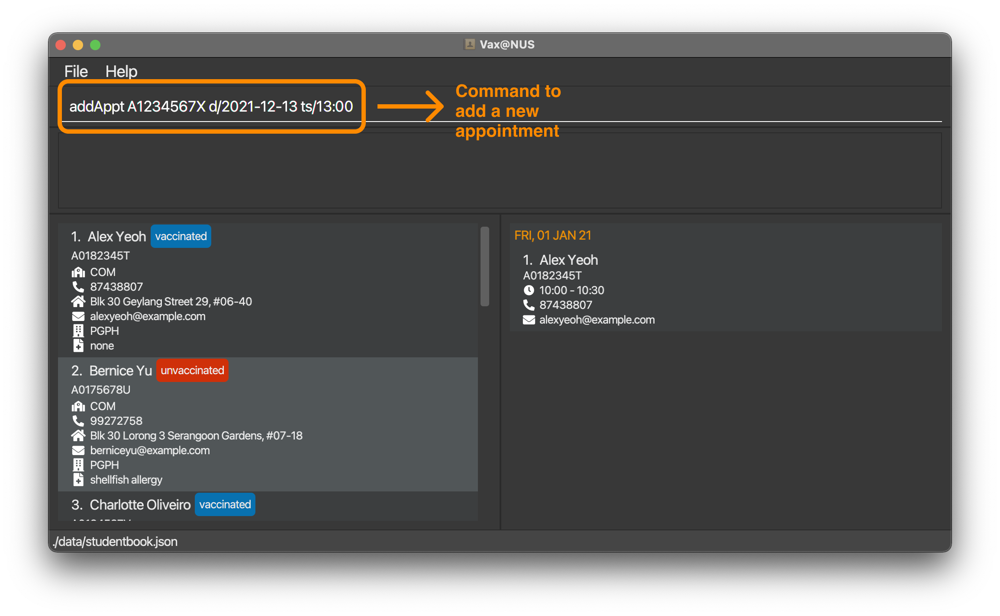

2. The new appointment will be added to the end of the appointment list and into Vax@NUS' record.

#### Editing an appointment: `editAppt`

Edits an appointment present in Vax@NUS records by referencing the student's matriculation number. 

Format: `editAppt MATRICULATION_NUMBER d/DATE ts/START_TIME`

Examples:

1. Enter `editAppt A1234567X d/2021-11-13 ts/14:00` to change John Doe's appointment time from 1pm to 2pm.

2. The appointment list will display and reflect the latest change.
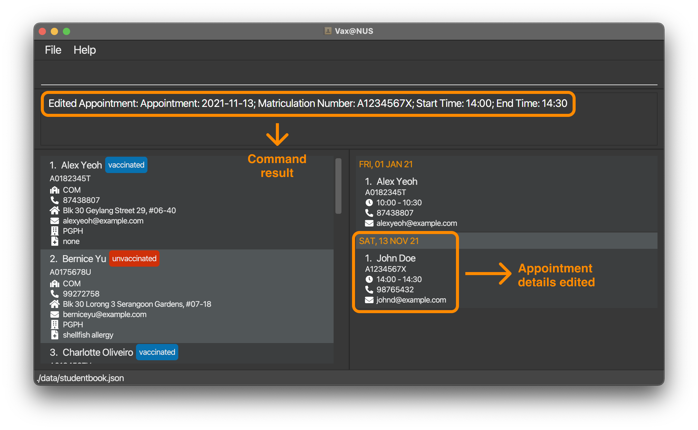

#### Deleting an appointment: `deleteAppt`

Deletes the appointment of the student with the specified matriculation number from Vax@NUS' records. 

Format: `deleteAppt MATRICULATION_NUMBER`

* If the matriculation number or appointment does not exist in the records, a message will be displayed to inform users that
  the matriculation number or appointment is not found.

Examples:
1.  `deleteAppt A1234567X` deletes John Doe's appointments from the records, provided he had an appointment scheduled previously.

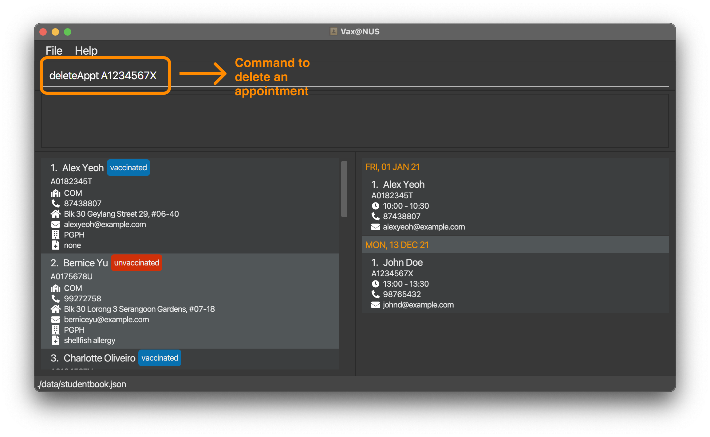

2. The list of appointments will be updated accordingly after the appointment deletion.  

#### Viewing statistics for appointments: `statsAppt`

Displays the number of upcoming and previous appointments within 1 week from the current day, including the current day.
E.g., if today is Monday, `statsAppt` will count upcoming appointments from Monday(Today) - Sunday and past appointments from last Tuesday - Monday(Today).

Format:  
`statsAppt`

1. Enter `statsAppt` to keep track of the numbers of appointments in a week.  
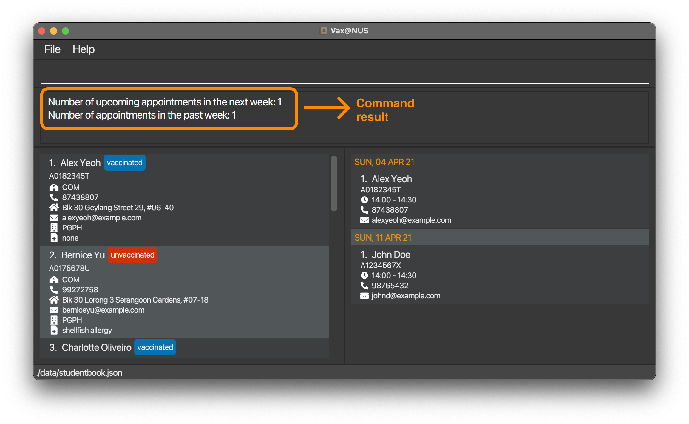
> Remark: Screenshot was taken on 9 April 2021.

#### Finding a student and their appointment : `find`

Shows personal information, including appointment details if present, of the student that matches the specified matriculation number.

Format: `find MATRICULATION_NUMBER`

* If the matriculation number does not exist in the records, a message will be shown to inform users that 
  the matriculation number is not found.
* If the student found does not have an appointment, the appointment list will appear as empty.
  
Examples:

1. `find A1234567X` shows John Doe's personal information, and his appointment details if it is present.

## Input Formats

The following parameter formats must be followed:

### Matriculation Number
 The `MATRICULATION_NUMBER` of a student is a unique 9-character alphanumeric sequence that begins with A, followed by
 7 numbers and ends with an alphabet.

### Faculty

 The `FACULTY` of a student must be one of the following(case-sensitive):
 * FASS (for Faculty of Arts and Social Sciences)
 * BIZ (for NUS Business School)
 * COM (for School of Computing)
 * SCALE (for School of Continuing and Lifelong Education)
 * DEN (for Faculty of Dentistry)
 * SDE (for School of Design and Environment)
 * DNUS (for Duke-NUS Medical School)
 * ENG (for Faculty of Engineering)
 * ISEP (for Integrative Sciences and Engineering)
 * LAW (for Faculty of Law)
 * MED (for Yong Loo Lin School of Medicine)
 * MUSIC (for Yong Siew Toh Conservatory of Music)
 * SPH (for Saw Swee Hock School of Public Health)
 * SPP (for Lee Kuan Yew School of Public Policy)
 * SCI (for Faculty of Science)
 * USP (for University Scholars Programme)
 * YNC (for Yale-NUS College)

### Vaccination Status

 The `VACCINATION_STATUS` of a student must only be `vaccinated` or `unvaccinated`. It is not case-sensitive. 
 
### School Residence

 The `[SCHOOL_RESIDENCE]` of a student must be one of the following(case-sensitive):
 * PGPH (for Prince George's Park House)
 * PGPR (for Prince George's Park Residences)
 * KE7H (for King Edward VII Hall)
 * SH (for Sheares Hall)
 * KRH (for Kent Ridge Hall)
 * TH (for Temasek Hall)
 * EH (for Eusoff Hall)
 * RH (for Raffles Hall)
 * RVRC (for Ridge View Residential College)
 * YNC (for Yale-NUS College)
 * TC (for Tembusu College)
 * CAPT (for College of Alice and Peter Tan)
 * RC4 (for Residential College 4)
 * USP (for University Scholars Programme)
 * UTR (for Utown Residences)
 * DOES_NOT_LIVE_ON_CAMPUS

If unindicated, the `School Residence` field will default to `DOES NOT LIVE ON CAMPUS`

### Appointments
* `DATE` must be of the format `YYYY-MM-DD`
* `START_TIME` must be of the format `HH:00` or `HH:30`.
* The duration of each appointment is fixed at 30 minutes.
* No appointment should clash with any other appointments.
* The student that the appointment is for must exist in the records.

--------------------------------------------------------------------------------------------------------------------

## FAQ

**Q**: What do I do if I accidentally delete a student? 
 
**A**: Unfortunately, the deletion is permanent. You will have to manually re-add the student.

**Q**: What can be included in medical details?
 
**A**: Allergies and past medical history.

**Q** : Am I able to reassign an appointment to another student?
 
**A** : No, you will need to add a new appointment for the new student. 

**Q**: Why are vaccinated students able to receive new appointments?
 
**A**: Beyond the two shots currently required for the approved Pfizer-BioNTech and Moderna vaccines in Singapore, booster shots could be required in the future to prolong immunity and provide protection against fast-emerging COVID-19 variants. 

**Q**: How long is a vaccination appointment?
 
**A**: Each vaccination appointment lasts 30 minutes, which includes registration, administering the vaccine and observation. 

**Q**: Why is matriculation number used to identify an appointment?  
**A**: This ensures that there are no duplicate appointments, and that appointments can only be made for NUS students.
        However, we recognise the limitations, and are working on an update where appointments are identified by a unique ID instead of matriculation number. 

-----------------------------------------------------------------------------------------------------------------
## Command Summary

#### General

Action | Format 
--------|------------------
**List All Data** | `list`
**View Help** | `help` 
**Clear All Data** | `clear` 
**Exit Program** | `exit`

  

#### Student Records Management  

Action | Format | Examples
--------|------- |-----------
**Add Student** | `add MATRICULATION_NUMBER n/NAME f/FACULTY p/PHONE_NUMBER e/EMAIL a/ADDRESS s/VACCINATION_STATUS m/MEDICAL_DETAILS [r/SCHOOL_RESIDENCE]` | `add A1234567X n/John Doe f/COM p/98765432 e/johnd@example.com a/John street, block 123, #01-01 s/vaccinated m/peanut allergy r/RVRC`
**Edit Student** | `edit INDEX [n/NAME] [f/FACULTY] [p/PHONE] [e/EMAIL] [a/ADDRESS] [s/VACCINATION_STATUS] [m/MEDICAL_DETAILS] [r/SCHOOL_RESIDENCE]` | `edit 1 p/91234567 f/MED`
**Delete Student** | `delete MATRICULATION_NUMBER` | `delete A1234567X`
**Filter Students** | `filter VACCINATION_STATUS`   `filter FACULTY`   `filter SCHOOL_RESIDENCE`| `filter vaccinated`   `filter COM`   `filter RVRC` 
**Find Student And Appointment** | `find MATRICULATION_NUMBER` | `find A1234567X`
**View Student Statistics** | `stats FACULTY` e.g., `stats COM`   `stats SCHOOL_RESIDENCE` | `stats RC4`   `stats NUS`   `stats all` 

#### Appointment Management 

Action | Format | Examples
--------|--------| ----------
**Add Appointment** | `addAppt MATRICULATION_NUMBER d/DATE ts/START_TIME` | `addAppt A1234567X d/2021-12-13 ts/13:00`
**Edit Appointment** | `editAppt MATRICULATION_NUMBER d/DATE ts/START_TIME`|`editAppt A1234567X d/2021-12-13 ts/14:00`
**Delete Appointment** | `deleteAppt MATRICULATION_NUMBER` | `deleteAppt A1234567X`
**Find Student And Appointment** | `find MATRICULATION_NUMBER` | `find A1234567X`
**View Appointment Statistics** | `statsAppt` | N.A.

--------------------------------------------------------------------------------

## Glossary

* **Index**: The number on the left side of the corresponding entry in the student records. 
* **Prefix**: The alphabet, followed by a forward slash (/), that precedes the student's details entered. 
* **Parameter**: The sequence of alphabets detailing containing a prefix and a student detail, forming part of a command. 
* **GUI**: An acronym that stands for Graphic User Interface.
* **CLI**: An acronym that stands for Command Line Interface.
* **Command**: The text typed in by the user as an instruction for Vax@NUS.
* **Case-sensitive**: Uppercase and lowercase letters are treated and parsed differently. 
* **Alphanumeric**: Alphanumeric characters are those comprised of the combined set of the 26 alphabetic characters, A to Z, and the 10 Arabic numerals, 0 to 9.
* **COVID-19**: The COVID-19 pandemic, also known as the coronavirus pandemic, is a global pandemic of coronavirus disease 2019 (COVID-19) caused by severe acute respiratory syndrome coronavirus 2 (SARS-CoV-2).
* **Vaccine**: Singapore has two approved COVID-19 vaccines, one developed by Pfizer-BioNTech,
  the other by Moderna. Both require two doses, 21 days apart for Pfizer-BioNTech, 28 days apart for Moderna.
* **NUS**: An acronym for National University of Singapore, one of Singapore's flagship publicly-funded universities. 
* **UHC**: An acronym for University Health Centre, a health service located on NUS campus for students. 
